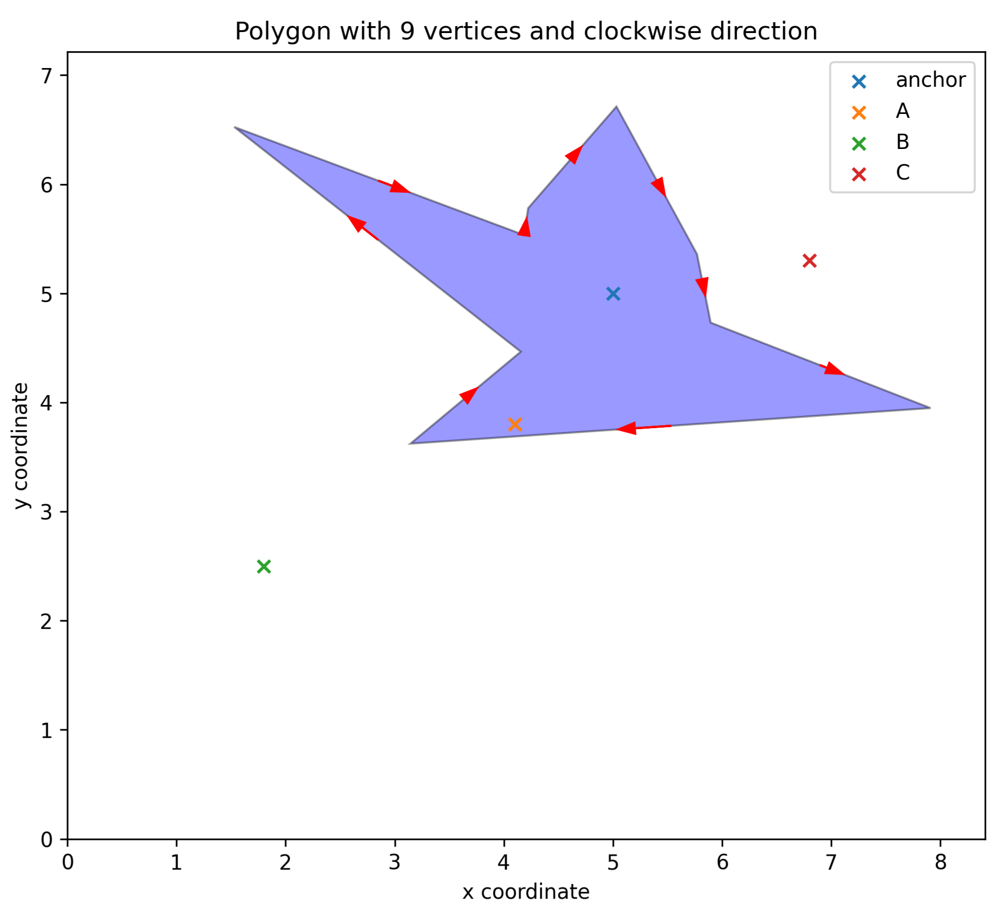
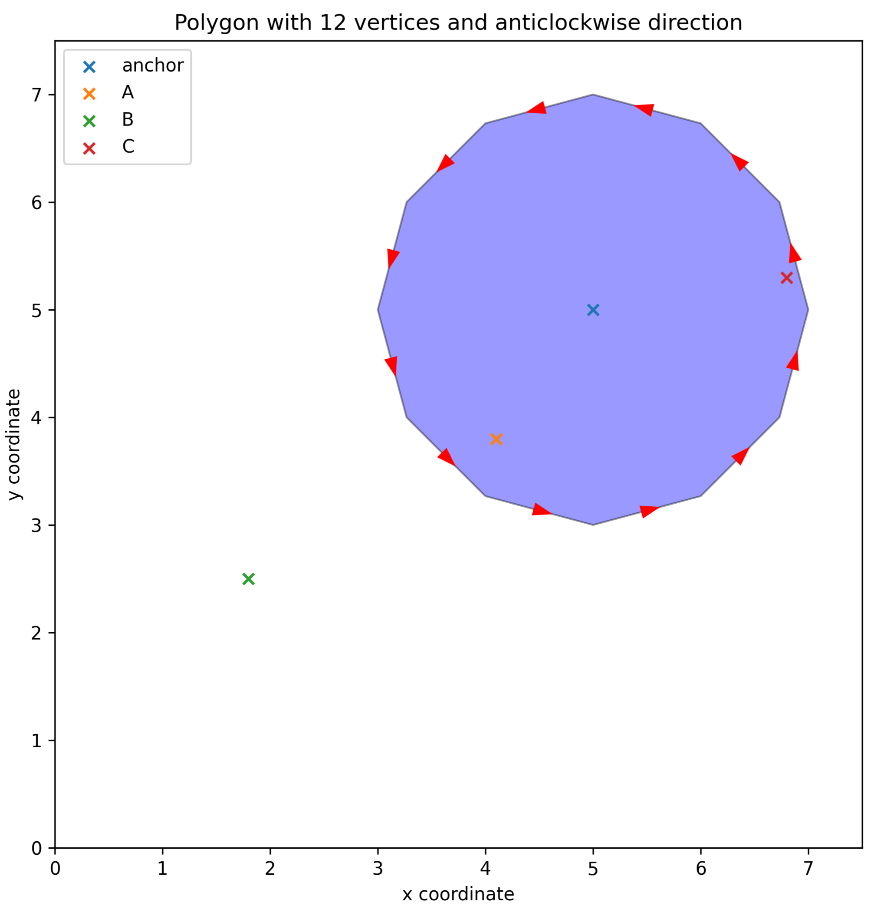
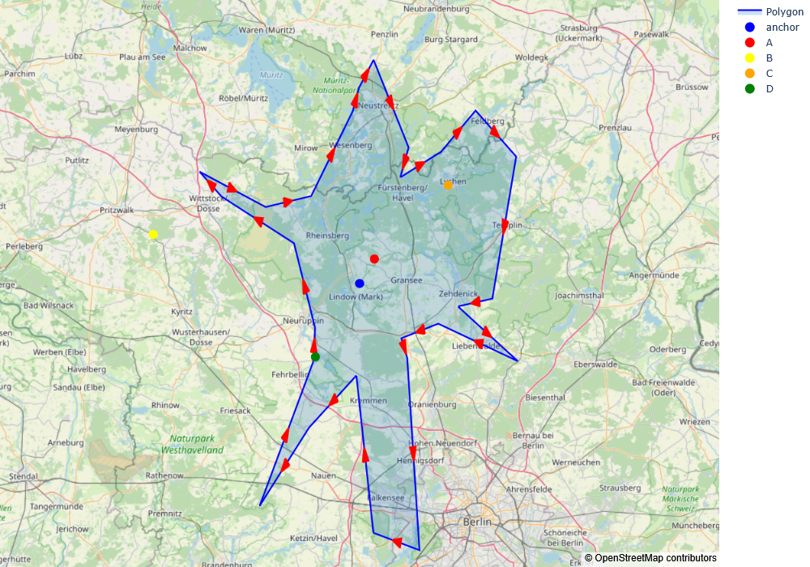
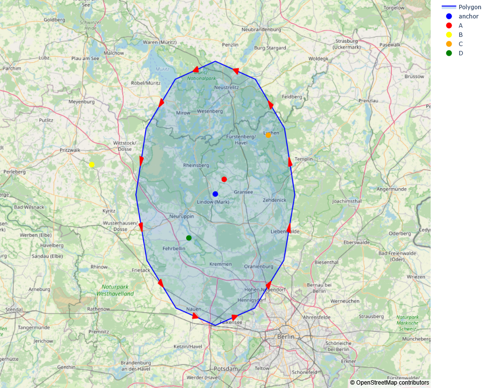

# Point in polygon problem
Implementation of the [*ray-crossing algorithm*](https://en.wikipedia.org/wiki/Point_in_polygon) to decide whether a point is inside or outside a polygon.

## 1 - Objective

The aim of this project is to give an implementation of the ray-crossing algorithm to decide whether a point is inside or outside a polygon and is purely pedagogical in purpose. The algorithm is implemented in both Euclidean dn spherical spaces.

## 2 - Repo organisation

**`point_in_polygon/`: The point-in-polygon modules**
It contains the point-in-polygon modules. See also Module architecture below.

**`notebooks/:` Notebooks demonstrating the modules**
- `PointInPolygon.ipynb`: Notebook discussing the basics of the the ray-crossing algorithm and showing the main fetures of the modules

**`pictures/:` Pictures generated with the module**
- `irre_euclidean_polygon.png`
- `re_euclidean_polygon.png`
- `irre_spherical_polygon.png`
- `re_spherical_polygon.png`

## 3 - Module architecture

Description of the module `molecular_dynamics` architecture.

- `point_in_polygon/__init__.py`
  - Initialises the module.
  - Imports the `PolygonE` class that handles polygons on Euclidean space.
  - Imports the `PolygonS` class that handles polygons on spherical space.

- `molecular_dynamics/polygon_euclidean.py`: defines the `PolygonE` class with the methods
  -  `creates`,
  -  `internal_point`.
- `molecular_dynamics/polygon_spherical.py`: defines the `PolygonS` class with the same methods as above.

## 4 - Features

- The `PolygonE` class:
  - generates a polygon in Euclidean space;
  - the polygons can be regular, irregular, concave or convex;
  - the irregular polygons are generated randomly;
  - the vertices can be ordered in clockwise or anticlockwise directions;
  - the generated polygons are mainly to test the ray-corssing algorithm for general enough polygon shapes. 
  - It has the following methods:
    - `create`: generates the vertices of the polygon from a chosen anchor point;
    - `internal_point`, check whether a given point is inside or outside the polygon using the ray-crossing algorithm.

- The `PolygonS` class:
  - generates a polygon on a 2-sphere;
  - the polygons can be regular, irregular, concave or convex;
  - the irregular polygons are generated randomly;
  - the vertices can be ordered in clockwise or anticlockwise directions;
  - the generated polygons are mainly to test the ray-corssing algorithm for general enough polygon shapes. 
  - It has the same methods as the `PolygonE` class.

## 5 - Results

As a test to the classes `PolygonE` and `PolygonS`, we have generated two polygons using each class, one irregular and the other regular, using the method `create`. We then considered a few points and checked if they where inside or outside the polygon using the method `inside_polygon`. 

### 5.1 - Euclidean polygon

- **Irregular Euclidean polygon**
 

  
*Figure 1: Irregular Euclidean polygon with 9 vertices and four points to be checked.*

  
Here is the result using the `inside_polygon` method.

  
| point  |   (x, y)   | is inside |
|--------|------------|-----------|
| anchor | (5.0, 5.0) |    True   |
|   A    | (4.1, 3.8) |    True   |
|   B    | (1.8, 2.5) |   False   |
|   C    | (6.8, 5.3) |   False   |

  

- **Regular Euclidean polygon**
 

  
*Figure 2: Regular Euclidean polygon with 12 vertices and four points to be checked.*

  
Here is the result using the `inside_polygon` method.

| point  |   (x, y)   | is inside |
|--------|------------|-----------|
| anchor | (5.0, 5.0) |    True   |
|   A    | (4.1, 3.8) |    True   |
|   B    | (1.8, 2.5) |   False   |
|   C    | (6.8, 5.3) |    True   |

  

### 5.2 - Spherical polygons

- **Irregular spherical polygon**
 

  
*Figure 3: Irregular spherical polygon with 26 vertices and five points to be checked.*

  
Here is the result using the `inside_polygon` method.

  
| point  |   (lat, lon)   | is inside |
|--------|----------------|-----------|
| anchor |  (53.0, 13.0)  |    True   |
|   A    | (53.05, 13.05) |    True   |
|   B    |  (53.1, 12.3)  |   False   |
|   C    |  (53.2, 13.3)  |    True   |
|   D    | (52.85, 12.85) |    True   |

  

- **Regular spherical polygon**
 

  
*Figure 4: Regular spherical polygon with 12 vertices and five points to be checked.*

  
Here is the result using the `inside_polygon` method.

  
| point  |   (lat, lon)   | is inside |
|--------|----------------|-----------|
| anchor |  (53.0, 13.0)  |    True   |
|   A    | (53.05, 13.05) |    True   |
|   B    |  (53.1, 12.3)  |   False   |
|   C    |  (53.2, 13.3)  |    True   |
|   D    | (52.85, 12.85) |    True   |

## 6 - Bibliography

- [M. Bevis and J.-L. Chatelain, Locating a point on a spherical surface relative to a spherical polygon of arbitrary shape. *Mathematical Geology* *21*, 811 (1989)](https://link.springer.com/article/10.1007/BF00894449).
